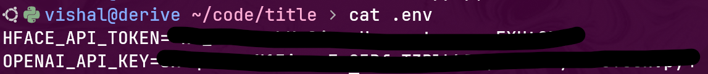
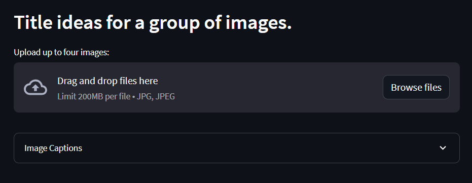
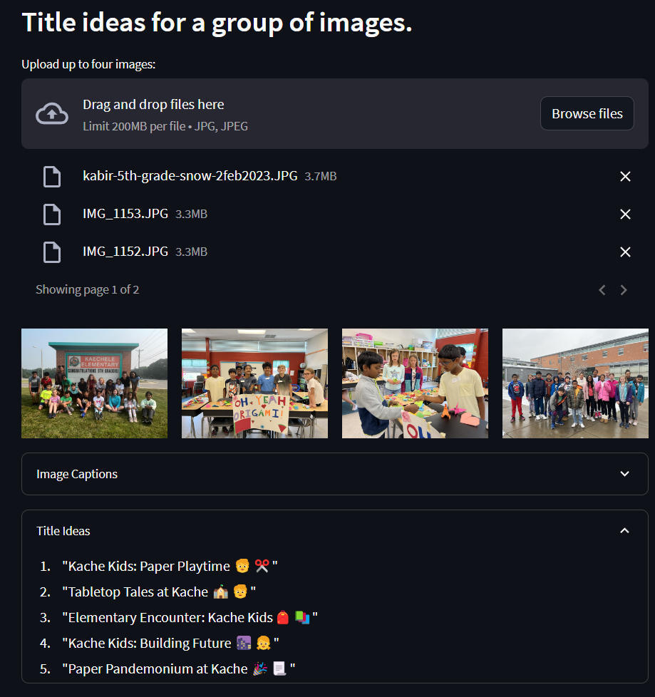

# Create a title for a group of images

This app can be used to create some title ideas for a group of images using LLM.

## Instructions to Launch the App 🚀

<details><summary><b>Show instructions</b></summary>

Once you clone this repo to your machine, activate a Python virtual environment using the following command:

`python -m venv .venv`

Once the Python virtual environment is created, activate it and install all dependencies from `requirements.txt`.

`source .venv/bin/activate`

`pip install -r requirements.txt`

Once all dependencies are installed, you can launch the app using the following command:

`streamlit run src/app.py`

In a few seconds the app will be lanuched in your browser. If that doesn't happen automatically, you can copy the URL that's printed in the output.

</details>

## Secrets 🔑

<details><summary><b>Show config settings</b></summary>

This app makes a call to the OpenAI API. You will need to get the API key from [OpenAI] and store it locally in the `.env` file.

This app also uses `espnet/kan-bayashi_ljspeech_vits` model from [HuggingFace] to create captions for each image. You will need to store the Huggingface API key in the same file as shown below:

<p align='center'>
	
</p>

Please note that you can change this model to another image-to-text model from HuggingFace in `src/config.py` file.

[OpenAI]:      https://openai.com
[HuggingFace]: https://huggingface.co/espnet/kan-bayashi_ljspeech_vits
</details>

## How to Use the App 🤔

<details><summary><b>Show instructions</b></summary>

Once the app is launched in a browser, you can upload JPG/JPEG images by either clicking on **Browse files** or by draggin and dropping files directly. Please be aware of the size limitation.

<p align='center'>
	
</p>

Once the images are uploaded, you will get the results in a few minutes. Here's a sample result for four images shown in the screenshot:

<p align='center'>
	
</p>

Note that the image captions (more on that below) are also displayed under the **Image Captions** section.

</details>

## How It Works ⚙️

<details><summary><b>Show details</b></summary>

We first generate a description, aka image captions, for each uploaded image based on image-to-text model from HuggingFace. 

Once all image descriptions are generated, we send them to GPT-4 via the OpenAI API with the following prompt:
```
    """Creates five title ideas based on the following image descriptions:"""
    template = """
    You are a creative title generator;
    You can suggest creative title ideas based on a set of phrases. Each title should capture as many concepts from all phrases as possible and it should be playful. Each title should have four words of less and it should contain no more than two relavant emojis.
    PHRASES: {img_descr}
    FIVE TITLE IDEAS:
    """
```

Where `img_descr` contains all image captions separated by commas. 

The GPT-4 model parses through the image captions and suggests five title ideas for that group of images.

Please note that the app uses **gpt-4-0613** from OpenAi. Please change it (to e.g., **gpt-3.5-turbo-0613** , if needed.
</details>
